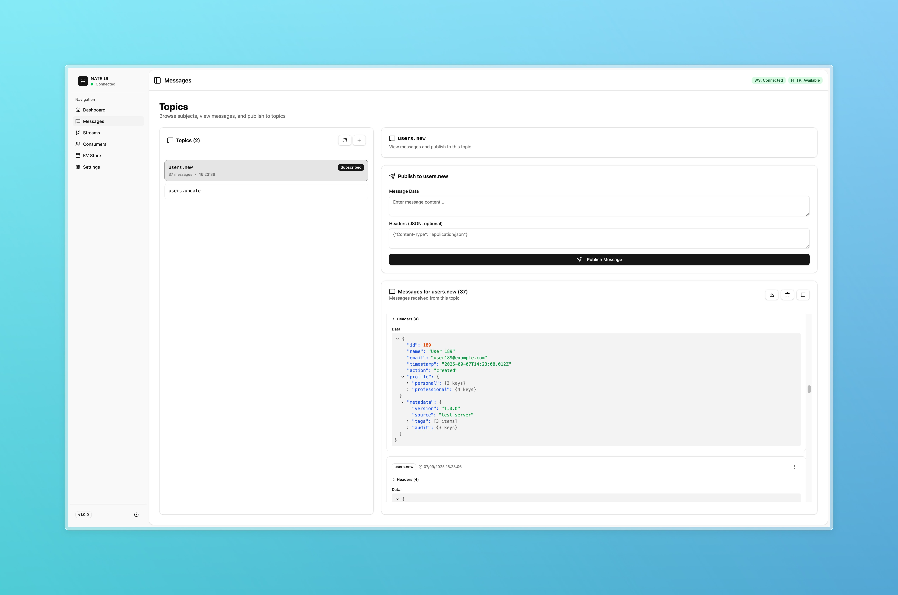

# NATS UI

> **The missing GUI for NATS.io** — Monitor messages, manage JetStream, control KV stores, all from your browser.

[](https://github.com/gastbob40/nats-ui/actions)
[](https://ghcr.io/gastbob40/nats-ui)
[](LICENSE)

<p align="center">
  <strong>
    🎯 Zero Config • 🚀 Real-time Everything • 📊 Built for DevOps • 🔌 WebSocket Native
  </strong>
</p>


## Why NATS UI?

**Stop juggling CLI commands**. NATS UI gives you:

✅ **See Everything** — Real-time message flow, server metrics, stream health at a glance  
✅ **Control Everything** — Publish, subscribe, create streams, manage consumers from one place  
✅ **Debug Everything** — Message inspector, header viewer, JSON formatter built-in  
✅ **No Setup Required** — Just point to your NATS server and start working  

Perfect for:
- 🚀 **Development** — Debug messages and test publishers locally
- 📊 **Operations** — Monitor production streams and consumer lag
- 📚 **Learning** — Understand NATS concepts visually

## Quick Start

Get up and running in **30 seconds**:

```bash
# Download and run NATS + UI with one command
curl -O https://raw.githubusercontent.com/gastbob40/nats-ui/main/docker/docker-compose.yml
curl -O https://raw.githubusercontent.com/gastbob40/nats-ui/main/docker/nats.conf
docker-compose up -d
```

🎉 **That's it!** Open http://localhost:3000 and start exploring.

## Features

### 📨 **Real-time Messaging**



- **Publish** messages with custom headers and payloads
- **Subscribe** to subjects with wildcard support  
- **Filter & Search** through message history
- **Format** JSON, text, and binary payloads automatically

### 🌊 **JetStream Management**


- **Create & Configure** streams with visual interface
- **Monitor** stream metrics and consumer lag
- **Manage** consumers (durable & ephemeral)
- **Set** retention policies and storage types

### 🗄️ **Key-Value Store**


- **Create** KV buckets with TTL support
- **Browse** keys with live updates
- **Edit** values with syntax highlighting
- **Track** revision history

### 📊 **Server Monitoring**


- **Live Metrics** — Connections, messages/sec, bandwidth
- **Health Status** — Server state and cluster info
- **Resource Usage** — Memory, CPU, storage
- **JetStream Stats** — Streams, consumers, messages

### 👥 **Consumer Management**


- **Monitor** consumer status and lag in real-time
- **View** delivery counts and acknowledgments
- **Manage** durable and ephemeral consumers
- **Track** processing performance and errors

### ⚙️ **Configuration**


- **Connect** to multiple NATS servers
- **Configure** WebSocket and HTTP endpoints  
- **Customize** refresh intervals and timeouts
- **Theme** support (Light/Dark/System)

## Installation

### Docker Compose (Recommended)

The project includes a ready-to-use Docker Compose setup with optimized NATS configuration:

```bash
# Clone the repository (or just download docker-compose.yml and nats.conf)
git clone https://github.com/gastbob40/nats-ui.git
cd nats-ui/docker

# Start everything
docker-compose up -d
```

This setup includes:
- **NATS Server** with JetStream enabled and optimized configuration
- **NATS UI** connected automatically
- **Persistent storage** for streams and messages
- **Health checks** and auto-restart

**Ports exposed:**
- `3000` - NATS UI Web Interface
- `4222` - NATS Client connections  
- `8222` - NATS HTTP Monitoring API
- `9222` - NATS WebSocket connections

### Using your own NATS Server

If you have an existing NATS server, just run the UI:

```bash
docker run -d \
  --name nats-ui \
  -p 3000:3000 \
  ghcr.io/gastbob40/nats-ui:latest
```

Then configure the connection in the UI settings to point to your NATS server.

## Configuration

### Connect to Your NATS Server

NATS UI requires **3 ports** from your NATS server:

| Port | Purpose | Required |
|------|---------|----------|
| **4222** | NATS client connections | ✅ |
| **8222** | HTTP monitoring API | ✅ |
| **9222** | WebSocket for real-time | ✅ |

The UI will auto-connect to `localhost` by default. To connect to a different server, use the Settings page in the app.

## Requirements

- **NATS Server** 2.9.0 or higher
- **Docker** (for containerized deployment)
- Modern browser with WebSocket support

## Tech Stack

**Frontend:**
- **React 19** - Modern React with concurrent features
- **TypeScript** - Type-safe JavaScript with strict configuration  
- **Tailwind CSS v4** - Utility-first CSS framework with Vite plugin
- **shadcn/ui** - High-quality, accessible React components
- **Radix UI** - Unstyled, accessible UI primitives
- **Lucide React** - Beautiful & consistent icon library

**Build & Tooling:**
- **Vite** - Next-generation frontend build tool
- **pnpm** - Fast, disk space efficient package manager

**NATS Integration:**
- **nats.ws** - WebSocket-based NATS client for browsers
- **@tanstack/react-query** - Powerful data synchronization

**State & Routing:**
- **React Router v7** - Declarative routing for React
- **next-themes** - Perfect dark mode support with system detection
- **React Hook Form + Zod** - Type-safe form validation

## License

This project is licensed under the BSD 3-Clause License - see the [LICENSE](LICENSE) file for details.

**You are free to:**
- ✅ Use commercially
- ✅ Modify and distribute
- ✅ Use privately
- ✅ Sublicense

**Requirements automatically enforced:**
- 🔒 **Must retain copyright notice** in source code
- 🔒 **Must include license** in binary distributions
- 🔒 **Cannot use project name** for endorsement without permission

---

<p align="center">
  <strong>Built for the NATS community</strong><br>
  <a href="https://github.com/gastbob40/nats-ui/issues">Report Bug</a> •
  <a href="https://github.com/gastbob40/nats-ui/issues">Request Feature</a> •
  <a href="https://nats.io">Learn NATS</a>
</p>